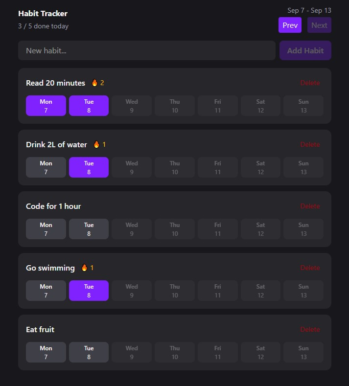

# Habit Tracker

A simple habit tracker built with React and TypeScript. The application allows users to create and manage habits, track their daily progress, and maintain streaks.

## Preview



## Features

- Add new habits
- Delete habits
- Mark habits as completed for a specific day
- Track daily progress
- Track consecutive completed days with streaks 🔥
- Navigate between weeks
- View the completion status of each habit throughout the week
- Display the number of completed habits for the current day
- Dark-themed user interface

## Technologies

- HTML5
- CSS3
- React
- TypeScript
- date-fns

## Installation

Clone the repository:

```
git clone https://github.com/your-username/habit-tracker.git
```

Navigate to the project directory:

```
cd habit-tracker
```

Install dependencies:

```
npm install
```

Start the development server:

```
npm run dev
```

The application will be available at the local development address provided by Vite.
